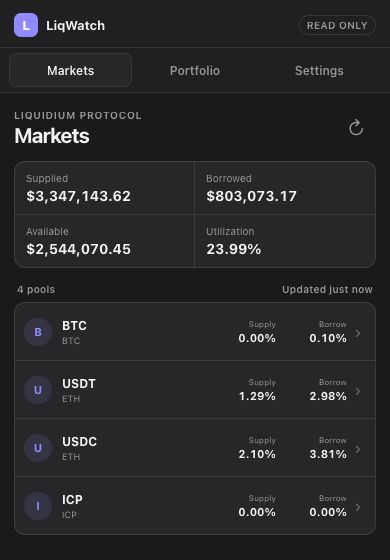
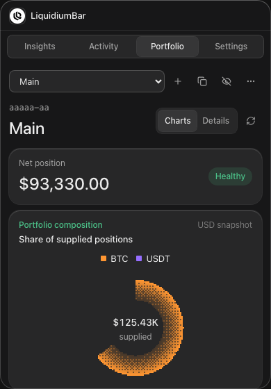
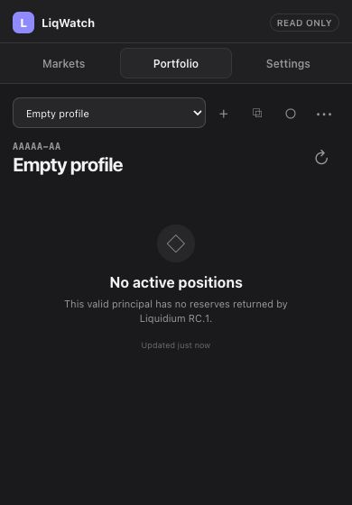
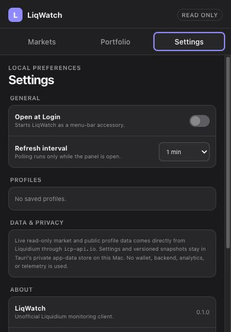

# LiqWatch

LiqWatch is an unofficial, read-only Liquidium monitor for the macOS menu bar. It shows live lending markets and the positions associated with public Liquidium profile principals without connecting a wallet or offering transactions.

The app is built with Tauri 2, React, TypeScript, TanStack Query, [Dither Kit](https://www.tripwire.sh/dither-kit), [Web3 Icons](https://web3icons.io), and `@liquidium/client@0.5.0-rc.1`. Dither Kit is installed from its official source registry and tracked by `dither-kit.json`. LiqWatch has no backend, analytics, telemetry, signing, or transaction path.

## Screenshots

| Protocol insights | Portfolio |
| --- | --- |
|  |  |

| Empty portfolio | Settings |
| --- | --- |
|  |  |

The populated portfolio screenshot uses a development-only fixture to demonstrate risk and reserve states; it is not live account data. Additional captures cover [onboarding](docs/screenshots/portfolio-onboarding.png), [loading](docs/screenshots/loading.png), and [network failure](docs/screenshots/error.png).

## What it does

- Runs as a 390×560 borderless macOS menu-bar panel with a monochrome template icon, accessory activation policy, tray-relative positioning, focus-loss hiding, and one reusable window.
- Shows a user-selected compact Supplied, Borrowed, or Available total beside the menu-bar icon—with no label—using the cached snapshot immediately at launch and quietly refreshing market data in the background.
- Opens directly to a compact Insights view with a Numbers mode for protocol totals and per-pool USD values. Graphs mode shows the totals row first, the supplied-market composition donut second, and supplied-versus-borrowed bars third. Detailed statistics stay on Liquidium's official Insights page.
- Uses a supplied-position composition pie for portfolios, with the persistent Graphs/Numbers switch exposing exact risk and APR figures when needed.
- Validates canonical principals, stores local profile labels, and supports profile switching, rename, removal, copy, privacy mode, and empty/error states.
- Shows supplied and borrowed value, collateral/risk metrics, derived health factor, weighted supply/borrow/net APR, and reserve rows when the SDK supplies the required inputs.
- Persists settings and versioned normalized snapshots with explicit `bigint` encoding so the last successful data remains available after restart or a refresh failure.
- Market totals refresh in the background for the menu-bar readout. Portfolio polling runs only while the panel is open. Query data becomes stale after 30 seconds; selectable polling intervals are 1, 2, or 5 minutes, with 5 minutes as the default.

## Architecture and data boundary

```text
macOS tray → Tauri window → React + TanStack Query
                              ↓
                     LiquidiumReadAdapter
                              ↓
              @liquidium/client@0.5.0-rc.1
                              ↓
                       https://icp-api.io
```

The RC dependency is isolated behind `LiquidiumReadAdapter`. The adapter constructs `new LiquidiumClient({ timeoutMs: 30_000 })` and calls only:

- `client.market.listPools()`
- `client.market.getAssetPrices()`
- `client.positions.getUserPositionSummary(profileId)`
- `client.positions.getUserReserves(profileId)`

Application contracts use scaled `bigint` amounts and ratios. Values are converted to JavaScript numbers only at the final display boundary. Profile syntax is checked with the explicitly pinned `@icp-sdk/core@5.4.0` principal implementation.

Rates are labeled APR. LiqWatch does not invent APY or compounding assumptions. Weighted and net APR are shown only when every required rate and price exists. Health factor is derived from liquidation-threshold and current-LTV basis points; the SDK's raw health-factor field is intentionally ignored because RC.1 does not document its scale reliably.

See [SDK capabilities](docs/SDK_CAPABILITIES.md), [compatibility results](docs/COMPATIBILITY.md), and [security and storage](docs/SECURITY.md) for the detailed contract.

## Develop and verify

Requirements:

- macOS 12 or newer
- Node.js 22 or newer
- pnpm 11.5.1
- A stable Rust toolchain with the Apple build tools

```sh
pnpm install --frozen-lockfile
pnpm tauri dev
```

Run the complete automated verification suite:

```sh
pnpm typecheck
pnpm lint
pnpm test
pnpm build
cargo fmt --manifest-path src-tauri/Cargo.toml --check
cargo clippy --manifest-path src-tauri/Cargo.toml --all-targets -- -D warnings
cargo test --manifest-path src-tauri/Cargo.toml
pnpm tauri build
```

The release build produces an `.app` and `.dmg` under `src-tauri/target/release/bundle/`. Developer ID signing and notarization require external Apple credentials and are not performed by this repository. Follow [release guidance](docs/RELEASE.md).

## Known data limitations

RC.1 does not provide a reliable contract for APY, compounding cadence, per-position collateral flags, price timestamps, human market names/icons, the raw health-factor scale, or profile-existence detection. A valid principal with no reserves—including `aaaaa-aa`—is shown as **No active positions**; LiqWatch cannot distinguish that from an unregistered profile.

This project is unofficial and is not affiliated with, endorsed by, or supported by Liquidium. Information may be delayed, incomplete, or incorrect and is not financial advice. Verify important values in official Liquidium interfaces before acting.
