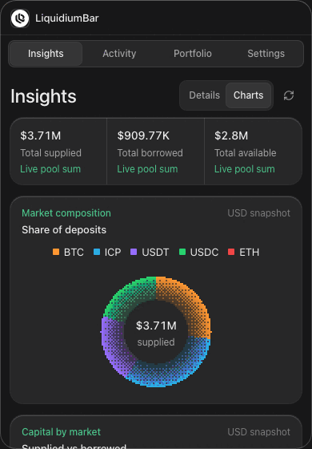
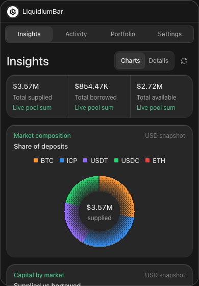
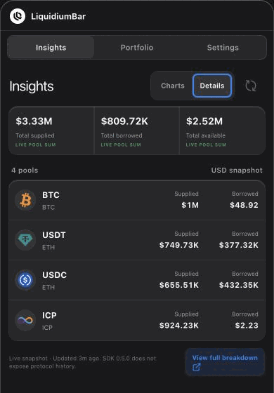
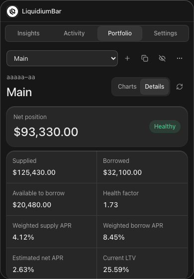

# LiquidiumBar

LiquidiumBar is an unofficial, read-only Liquidium monitor for the macOS menu bar. See protocol liquidity at a glance and monitor public positions without connecting a wallet or signing anything.

<p align="center">
  
</p>

## What it does

- Shows supplied, borrowed, and available liquidity across Liquidium markets.
- Displays market composition and supplied-versus-borrowed charts.
- Monitors a Liquidium profile from its principal or a linked Ethereum/Bitcoin address.
- Shows portfolio composition, balances, APR, LTV, and health factor.
- Optionally places a compact market total beside the macOS menu-bar icon.
- Stores settings and cached snapshots locally. No backend, analytics, telemetry, or transactions.

## Screenshots

### Insights

<p align="center">
  
  
</p>

### Portfolio

<p align="center">
  
  
</p>

### Settings

<p align="center">
  
</p>

## Install with Homebrew

LiquidiumBar currently supports Apple Silicon Macs:

```sh
brew install --cask dylanvanh/tap/liquidiumbar
```

The current build is not yet notarized by Apple. If macOS blocks the first
launch, try opening LiquidiumBar and then select **Open Anyway** in **System
Settings → Privacy & Security**.

## Run locally

Requires macOS, Node.js 22+, pnpm, Rust, and the Apple build tools.

```sh
pnpm install --frozen-lockfile
pnpm tauri dev
```

Create a release build with:

```sh
pnpm tauri build
```

The `.app` and `.dmg` are written to `src-tauri/target/release/bundle/`.

## Project notes

- Liquidium SDK: `@liquidium/client@0.5.1`
- [SDK capabilities](docs/SDK_CAPABILITIES.md)
- [Compatibility results](docs/COMPATIBILITY.md)
- [Security and local storage](docs/SECURITY.md)
- [Release guidance](docs/RELEASE.md)

LiquidiumBar is unofficial and is not affiliated with, endorsed by, or supported by Liquidium. Information may be delayed, incomplete, or incorrect and is not financial advice.
